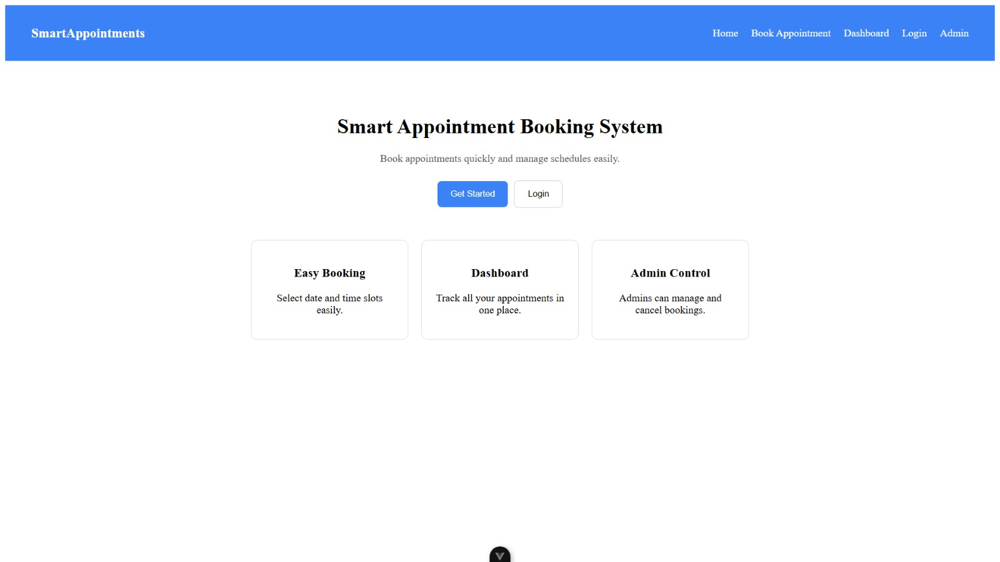
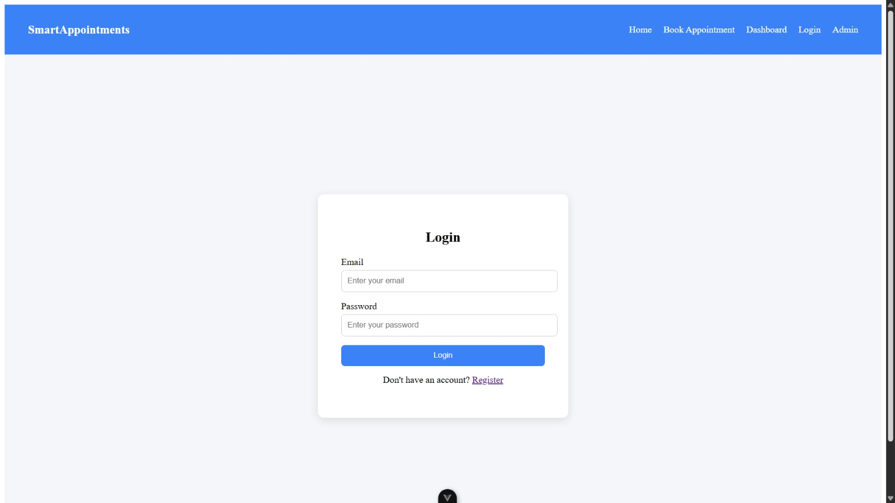
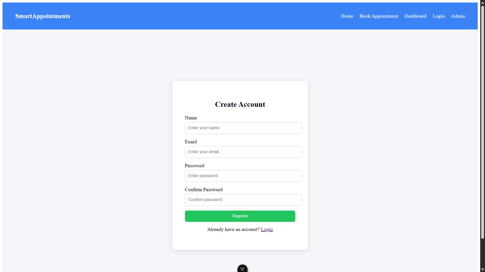
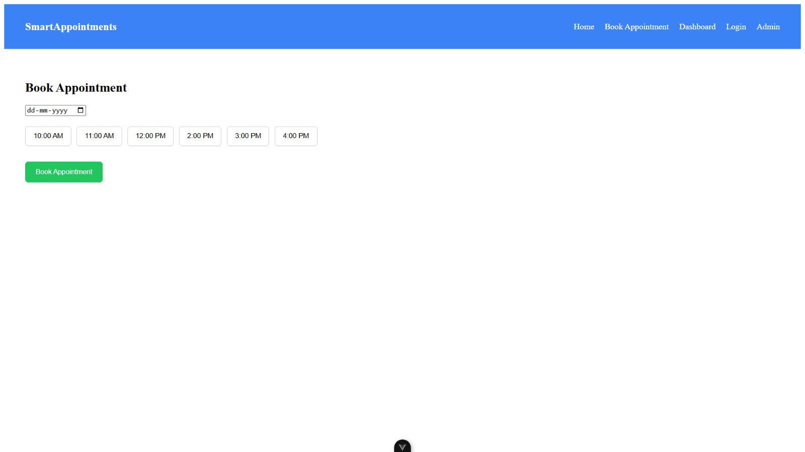
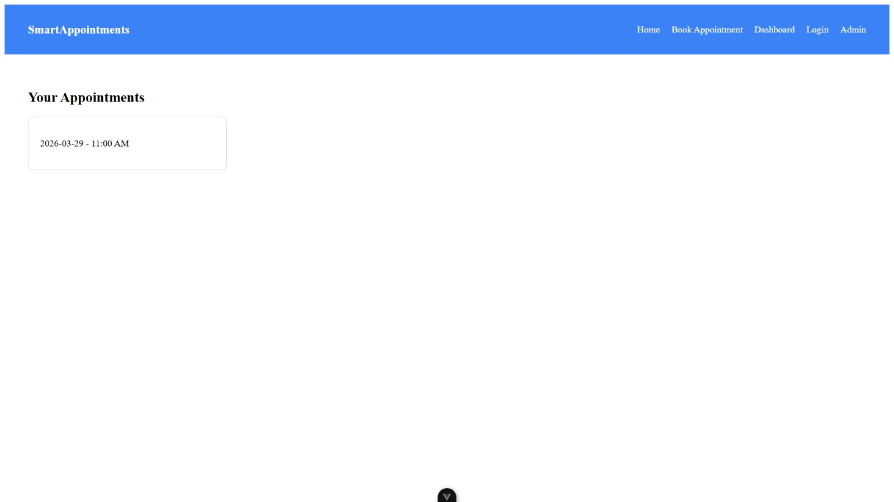
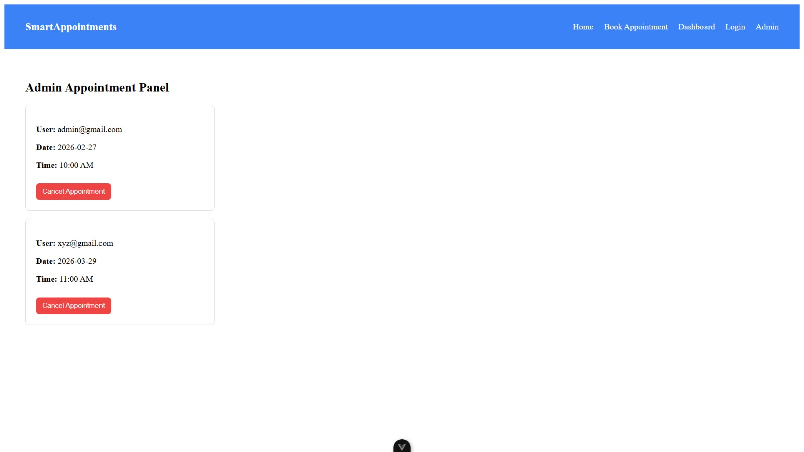

# Smart Appointment Booking System

A role-based appointment booking web application built using Vue 3 and TypeScript.  
Users can book appointment slots while admins can manage and cancel appointments.

---

## Features

- User authentication (Login / Register)
- Role-based access (Admin / User)
- Appointment booking with time slots
- Prevent double booking of slots
- User dashboard to view appointments
- Admin dashboard to manage bookings
- Persistent data using localStorage

---

## Tech Stack

Frontend:

- Vue 3
- TypeScript
- Vue Router
- Pinia (State Management)
- Vite

---

## Project Structure

# Smart Appointment Booking System

A role-based appointment booking web application built using Vue 3 and TypeScript.  
Users can book appointment slots while admins can manage and cancel appointments.

---

## Features

- User authentication (Login / Register)
- Role-based access (Admin / User)
- Appointment booking with time slots
- Prevent double booking of slots
- User dashboard to view appointments
- Admin dashboard to manage bookings
- Persistent data using localStorage

---

## Tech Stack

Frontend:

- Vue 3
- TypeScript
- Vue Router
- Pinia (State Management)
- Vite

---

## Project Structure

src
components
router
stores
views
HomeView.vue
LoginView.vue
RegisterView.vue
DashboardView.vue
BookAppointmentView.vue
AdminDashboardView.vue

---

## Installation

Clone the repository:

git clone https://github.com/your-username/smart-appointment-booking.git

Install dependencies:

npm install

Run the development server:

npm run dev

---

## Screenshots

### Home Page

### Login Page

### Register Page

### Book Appointment

### User Dashboard

### Admin Dashboard

---

## Future Improvements

- Backend API with Node.js + Express
- Database integration (MongoDB)
- Email notifications
- Calendar UI for slot selection

---

## Author

Vajiha Fathema
